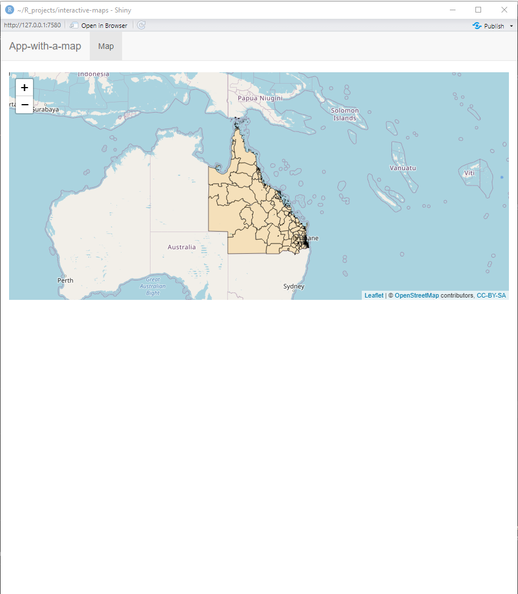
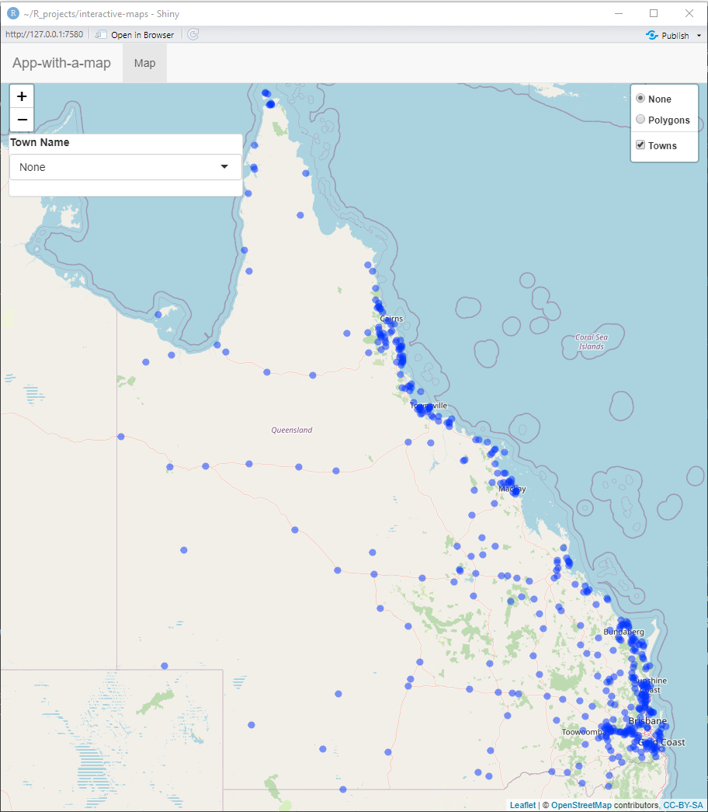

# An app with a map {#shiny-intro}

This chapter will have a brief intro to shiny with a map:

* ui and server
* reactivity
* leaflet
* leafletproxy

## A bare bones shiny app

The most basic shiny app has a user-interface (`ui`) and a back-end (`server`) side. We control what content appears where on within the ui, and we control all the clever interactivity and generated content on the server side. 

```{r, eval=FALSE}
library(shiny)

ui <- fluidPage(
  
)

server <- function(input, output, session) {
  
}

shinyApp(ui, server)

```

This book will include many example shiny apps and accompanying code. However, since it'd be very time consuming to host all those apps independently, I will instead provide the code and sometimes an image of how the app displays. With every example app there will be a followup line of code with `shiny::runGitHub(...)` that you can use to run the app locally. If you run this line in R on your own computer, it will run the app in a way that you can then interact with it.


The inputs on the ui side always have an inputId and it is by this name that we access those values from the server. In the code below, we name an input as 'n' and we access it in the server by calling `input$n`. By accessing this input in such as way, within the expression used for `renderPlot()`, we are are asking the server side to update the plot every time that any inputs (`input$___`) used within it are updated.

```{r 01-example-app}
library(shiny)

ui <- fluidPage(
  numericInput(inputId='n', label='sample size', value=10),
  plotOutput('plot')
)

server <- function(input, output, session) {
  output$plot <- renderPlot(expr={
    hist(x=rnorm(input$n))
  })
}

shinyApp(ui, server)
```

(And here's your code to run the app locally)
```{r eval=FALSE}
shiny::runGitHub("RWParsons/interactive-maps", subdir="input/apps/01-example-app/")
```


## Leaflet maps in shiny

We're not here to make histograms, we're here to make maps!
I prefer the navigation between tabs (which you may want later) using `navbarPage` to design my ui.
These pages contain many panels that you can navigate between. Here's an app with a single `tabPanel` which contains our map.

```{r 02-first-leaflet-map, eval=F}
library(shiny)
library(leaflet)
library(tidyverse)
input_dir <- "./input"

sa2_polygons <- readRDS(file.path(input_dir, "stacked_SA1_and_SA2_polygons_year2016_simplified.rds")) %>%
  filter(SA_level==2)

ui <- navbarPage(
  "App-with-a-map", id="nav",
  tabPanel(
    "Map",
    leafletOutput('map')
  )
)

server <- function(input, output, session) {
  output$map <- renderLeaflet({
    leaflet() %>%
      addTiles() %>%
      addPolygons(
        data=sa2_polygons,
        fillColor="Orange",
        color="black",
        weight=1,
        group="Polygons"
      )
  })
}

shinyApp(ui, server)
```

<center>
{width=300px align=center}
</center>

```{r, eval=FALSE}
shiny::runGitHub("RWParsons/interactive-maps", subdir="input/apps/02-first-leaflet-map/")
```


### Filling the space

You might notice a few things here that you'd like to change with the ui already. Without getting into details like the colours of the panels, a major issue is that the map doesn't fill the entire space in the panel. Before we get into user-inputs, and for my own sanity, this has to be fixed.

Unfortunately, this is a surprisingly annoying thing to do. If you change the height and width of the map to be 100% of the viewport height and width (by using `height="100vh", width="100vw"` in `leafletOutput()`) then you end up with a padding distance between the map and the panel, and an offset from above due to the height of the top panel bar. The best solution is to create a division (`div`), remove its padding, and fill the space left with the map (100%). This means a little bit of CSS code and then assigning it to the division which wraps the map. I get the CSS code and the division to talk to eachother by assigning the class of the division to be 'outer' and assigning the aesthetic changes to 'div.outer' in the CSS code. The 41px that I remove at the top is due to the top bar of the navbarPage being 41px high.

```{r 03-fill-panel-with-css, eval=FALSE}
library(shiny)
library(leaflet)
library(tidyverse)
input_dir <- "./input"

sa2_polygons <- readRDS(file.path(input_dir, "stacked_SA1_and_SA2_polygons_year2016_simplified.rds")) %>%
  filter(SA_level==2)

ui <- navbarPage(
  "App-with-a-map", id="nav",
  tabPanel(
    "Map",
    div(
      class="outer",
        tags$head(
          tags$style(HTML("
            div.outer {
              position: fixed;
              top: 41px;
              left: 0;
              right: 0;
              bottom: 0;
              overflow: hidden;
              padding: 0;
            }
            "
          ))
        ),
      leafletOutput('map', height="100%", width="100%")
    )
  )
)

server <- function(input, output, session) {
  output$map <- renderLeaflet({
    leaflet() %>%
      addTiles() %>%
      addPolygons(
        data=sa2_polygons,
        fillColor="Orange",
        color="black",
        weight=1,
        group="Polygons"
      )
  })
}

shinyApp(ui, server)
```
<center>
{width=300px align=center}
</center>
```{r, eval=FALSE}
shiny::runGitHub("RWParsons/interactive-maps", subdir="input/apps/03-fill-panel-with-css/")
```

Now we have an app with a map, not just an app with a map (and painfully empty space).
<center>
{width=300px align=center}
</center>

## Leaflet vs shiny interactivity

There are interactive elements which come in leaflet before even incorporating shiny. For example, in the previous chapter we made a leaflet map that had a layer selector which gives the user control over what polygon layer (SA1, SA2, SA3) was being displayed on the map. This functionality is all leaflet based and incorporating it into a shiny app doesn't require adding any inputs to the ui side of the shiny app! This is great, because it doesn't depend on the server side to do any heavy lifting, and it can be functional while the server side is busy doing other operations. If possible, it's best to make use of this interactivity that leaflet has to offer: this means less code to maintain and less work for the server where you host your shiny app.

However, we will need to incorporate shiny inputs at the point where we want to add features to our app that leaflet doesn't have for us. To do this, we update our map very differently to how we updated the histogram in our first app example. Re-making the map is computationally expensive and would drastically slow down how quick the map responds to your inputs. In the histogram example, we used the following code.

```{r, eval=FALSE}
output$plot <- renderPlot(expr={
  hist(x=rnorm(input$n))
})
```

`renderPlot()` takes a few arguments but the one we care most about is the first: `expr`.  Since it's always the first argument of all the `render___()` functions, we don't normally bother with the `expr=`. This is the expression (code) that creates the plot. Since it reads an input, every time that the `input$n` is updated, the server side reacts by updating it's output which is then displayed to the user.

For our leaflet maps, we don't want to use user inputs in our `renderLeaflet()` expression as this would mean redrawing the content delays for the user. Instead, we observe changes to the inputs and update our map via a proxy.

In the app below, we add some leaflet interactivity as well as some shiny reactivity. 

This map has a toggle to switch between showing the polygons and towns. Also, clicking on the markers for the towns will show a popup. The popup content is assigned when adding the circle markers (`addCircleMarkers()`) and you can use HTML tags to customise how it displays. All of this interactivity was made when we first rendered the leaflet map.

We also added an panel to hold a drop down menu containing names of all the towns that we have on the plot. If you select a town, this updates the input$town_name which triggers some reactivity since it is being observed. When a town is selected, the map will zoom to its coordinates. If none is selected, it zooms out to look at all of Queensland. This part is controlled by shiny reactivity. It updates the existing map by using `leafletProxy()`.
This takes one argument: the id of the map, which is the same as the output id (we used `output$map`) so we update our map with `leafletProxy(mapId="map")`. This functionality is only for shiny apps and shiny docs, it allows us to add or modify content on our existing map without having to render it again. We used the `flyTo` and `flyToBounds` functions to update our map to move to the given location. However, we could can make all sorts of modifications and additions to our map in this way!

```{r 04-leaflet-and-shiny-interactivity, eval=FALSE}
library(shiny)
library(leaflet)
library(tidyverse)
input_dir <- "./input"

sa2_polygons <- readRDS(file.path(input_dir, "stacked_SA1_and_SA2_polygons_year2016_simplified.rds")) %>%
  filter(SA_level==2)

towns <- read.csv(file.path(input_dir, "df_towns.csv")) 

ui <- navbarPage(
  "App-with-a-map", id="nav",
  tabPanel(
    "Map",
    div(
      class="outer",
        tags$head(
          tags$style(HTML("
            div.outer {
              position: fixed;
              top: 41px;
              left: 0;
              right: 0;
              bottom: 0;
              overflow: hidden;
              padding: 0;
            }
            "
          ))
        ),
      leafletOutput('map', height="100%", width="100%"),
      absolutePanel(
        top=75, left=10, 
        class = "panel panel-default",
        selectInput('town_name', 'Town Name',
                  choices = c('None', sort(towns$location)),
                  selected = "None")
      )
    )
  )
)

server <- function(input, output, session) {
  
  observe({
    if(input$town_name!="None") {
      town_df <- towns[towns$location==input$town_name, ]
      leafletProxy("map") %>%
        flyTo(lng=town_df$x, lat=town_df$y, zoom=10)
    } else {
      leafletProxy("map") %>%
        flyToBounds(
          lng1 = 137.725724, lat1 = -28.903687, 
          lng2 = 151.677076, lat2 = -10.772608
        )
    }
  })
  
  output$map <- renderLeaflet({
    leaflet() %>%
      addTiles() %>%
      addPolygons(
        data=sa2_polygons,
        fillColor="Orange",
        color="black",
        weight=1,
        group="Polygons"
      ) %>%
      addCircleMarkers(
        lng=towns$x,
        lat=towns$y,
        popup=glue::glue("<b>Location:</b> {towns$acute_care_centre}"),
        radius=2, 
        fillOpacity=0,
        group="Towns"
      ) %>%
      addLayersControl(
        position="topright",
        baseGroups=c("None", "Polygons"),
        overlayGroups=c("Towns"),
        options=layersControlOptions(collapsed = FALSE)
      )
  })
}

shinyApp(ui, server)
```
<center>
{width=300px align=center}
</center>
```{r, eval=FALSE}
shiny::runGitHub("RWParsons/interactive-maps", subdir="input/apps/04-leaflet-and-shiny-interactivity/")
```

We used a range of features from both leaflet and shiny to make iTRAQI interactive. This was a very brief introduction to reactivity and shiny. I recommend reading the [sections 1-3 of Mastering Shiny](https://mastering-shiny.org/basic-app.html) as the next chapter will cover specific tricks to add specific features to your maps won't do as good of a job introducing the fundamentals of shiny as Mastering Shiny does.

